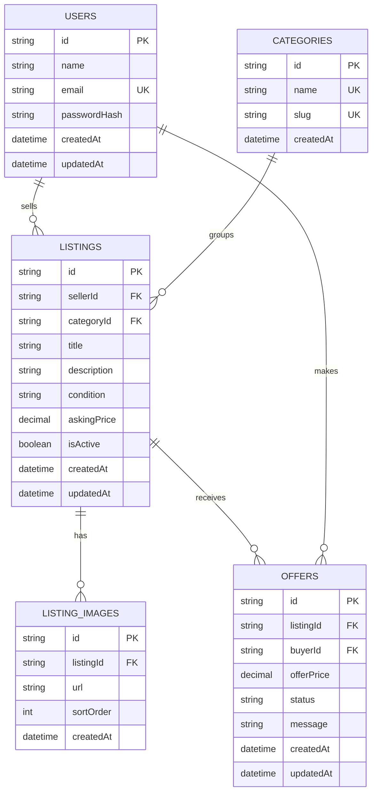

# ERD

```mermaid
erDiagram
  USERS ||--o{ LISTINGS : sells
  CATEGORIES ||--o{ LISTINGS : groups
  LISTINGS ||--o{ LISTING_IMAGES : has
  LISTINGS ||--o{ OFFERS : receives
  USERS ||--o{ OFFERS : makes

  USERS {
    string id PK
    string name
    string email UK
    string passwordHash
    datetime createdAt
    datetime updatedAt
  }

  CATEGORIES {
    string id PK
    string name UK
    string slug UK
    datetime createdAt
  }

  LISTINGS {
    string id PK
    string sellerId FK
    string categoryId FK
    string title
    string description
    string condition
    decimal askingPrice
    boolean isActive
    datetime createdAt
    datetime updatedAt
  }

  LISTING_IMAGES {
    string id PK
    string listingId FK
    string url
    int sortOrder
    datetime createdAt
  }

  OFFERS {
    string id PK
    string listingId FK
    string buyerId FK
    decimal offerPrice
    string status
    string message
    datetime createdAt
    datetime updatedAt
  }
```
